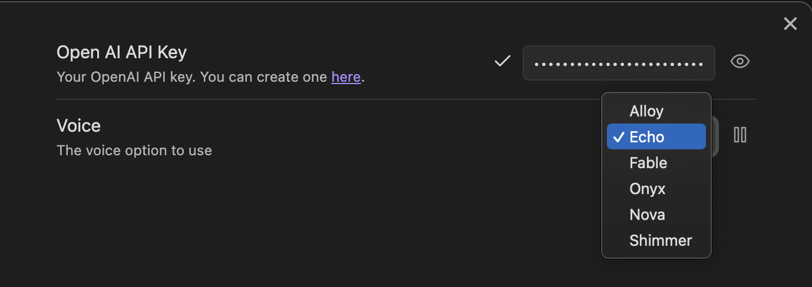

# Aloud Text To Speech Obidian Plugin

Highlight and speak text from your Obsidian notes. Converts text to audio using lifelike voices from OpenAI.

<video src="https://github.com/adrianlyjak/obsidian-aloud-tts/assets/2024018/6e673350-0cf2-4820-bca1-3f36cd3a24f6" ></video>

Just add your OpenAI API key. Choose from 6 voices. OpenAI charges Audio at [$0.015 per 1,000 characters](https://openai.com/pricing). That's around $12 for the ~800,000 character text of A Tale of Two Cities.

</img>

Listen immediately. Audio is streamed sentence-by-sentence. Includes controls to skip forward and backwards
to replay.

Audio is cached in your vault to reduce costs, and automatically removed after a few hours. Files are stored in the `.tts` directory.

### Alternate TTS Models

You can also run alternate models if you have OpenAI compatible API server that has an `/v1/audio/speech` endpoint. For example [openedai-speech](https://github.com/matatonic/openedai-speech). Just configure the url in the plugin settings
