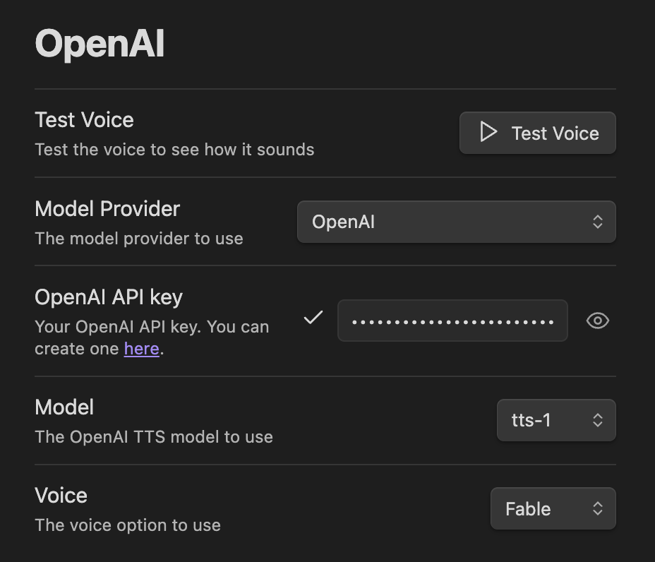
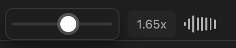
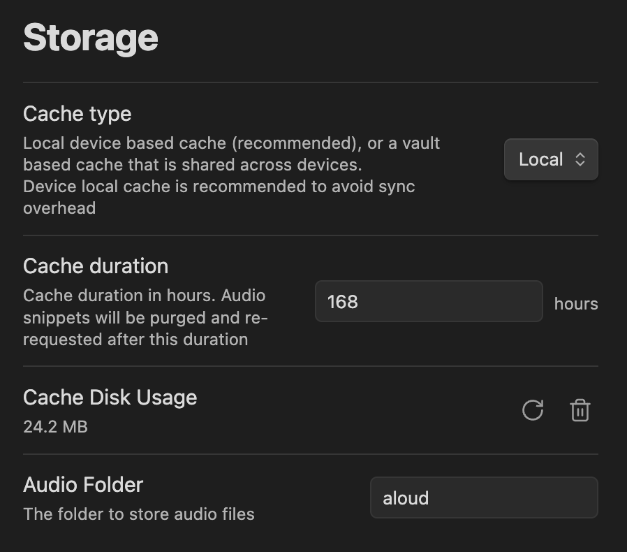
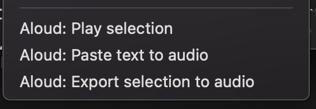
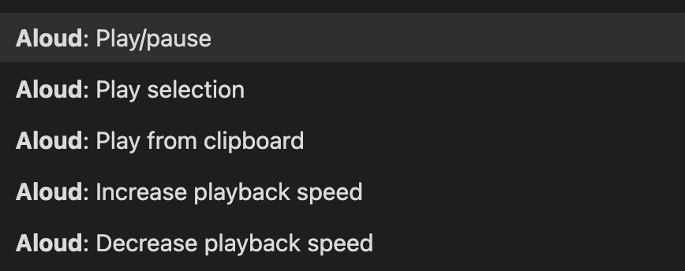

# Aloud Text To Speech Obsidian Plugin

Highlight and speak text from your Obsidian notes. Converts text to audio using lifelike voices from various providers.

<video src="https://github.com/adrianlyjak/obsidian-aloud-tts/assets/2024018/6e673350-0cf2-4820-bca1-3f36cd3a24f6" ></video>

Just add your API key from a supported provider. Choose from available voices.

</img>

### Supported TTS Models:

*   **OpenAI:** (e.g., `tts-1`, `tts-1-hd`, `gpt-4o-mini`). OpenAI charges Audio at [$0.015 per 1,000 characters](https://openai.com/pricing).
*   **Google Gemini:** (Currently supporting Gemini 2.5 series)
*   **Hume AI:** (Supports various Hume AI voices with customization options)

You can also configure a custom API endpoint if you have an OpenAI compatible API server that has an `/v1/audio/speech` endpoint. For example [openedai-speech](https://github.com/matatonic/openedai-speech).

### Features:

**Visual Feedback:** Active sentence is highlighted and updated as playback progresses.

**Listen immediately:** Audio is streamed sentence-by-sentence. Jump back and forth by skipping by sentence.

**Variable Speeds:** On device playback rate adjustor for improved audio quality.

</img>

**Caching:** Audio is cached in your vault to reduce costs, and automatically removed. Cache duration is configurable. Audio may be cached device local or in a vault directory.

</img>

**Export and Embed Audio:** Quickly export to audio files: export audio files from selection, or embed audio by pasting text from your clipboard.

</img>

**Play text from anywhere:** Lots of commands. Play text to speech directly from your clipboard.

</img>

**OS Integration:** Integrates with your mobile phone to play while locked. Pause/Play with OS controls on desktop.

### Alternate TTS Models

You can also run alternate models if you have OpenAI compatible API server that has an `/v1/audio/speech` endpoint. For example [openedai-speech](https://github.com/matatonic/openedai-speech). Just configure the url in the plugin settings
