# Audio Player Architecture

This document explains how the audio playback system works through the collaboration of three main components: `ChunkPlayer`, `ChunkLoader`, and `AudioSink`.

## Overview

The audio player architecture is designed to provide seamless text-to-speech playback with intelligent buffering, caching, and state management. The system breaks text into chunks and loads them incrementally while maintaining smooth playback.

## Component Overview

### ChunkPlayer
The orchestrator that manages the entire playback lifecycle, coordinates between components, and handles state transitions.

### ChunkLoader
The loading and caching engine that manages audio chunk requests, background loading, and persistent storage.

### AudioSink
The low-level audio playback engine that handles streaming audio data using the Web Audio API.

## Architecture Diagram


## Component Details

### ChunkPlayer (The Orchestrator)

The `ChunkPlayer` is the central coordinator that manages the entire audio playback lifecycle.

#### Key Responsibilities:
- **State Management**: Monitors playing state, position changes, and text modifications
- **Buffer Management**: Ensures chunks are loaded ahead of playback position
- **Coordination**: Orchestrates between ChunkLoader and AudioSink
- **Event Handling**: Responds to seek events, play/pause, and settings changes
- **Error Recovery**: Handles interruptions and state resets

#### Main Loop Flow:


#### Buffer Management:
- Maintains a configurable buffer ahead of current position (default: 3 chunks)
- Preloads chunks with context for smooth TTS transitions
- Expires old chunks behind current position to manage memory

### ChunkLoader (The Loading Engine)

The `ChunkLoader` manages audio chunk loading with sophisticated caching and background processing.

#### Key Features:
- **Local Memory Cache**: Fast access to recently loaded chunks
- **Background Queue**: Preloads chunks without blocking playback
- **Persistent Storage**: Long-term caching via storage layer
- **Retry Logic**: Automatic retry with exponential backoff
- **Context Awareness**: Includes surrounding text for better TTS quality

#### Loading Flow:


#### Caching Strategy:
- **Memory Cache**: Short-term (60s TTL) for immediate reuse
- **Persistent Storage**: Long-term storage across sessions
- **Background Loading**: Proactive loading during idle time
- **Queue Management**: Prioritizes chunks near current position

### AudioSink (The Playback Engine)

The `AudioSink` handles low-level audio streaming using the Web Audio API with MediaSource.

#### Key Features:
- **Streaming Playback**: Uses SourceBuffer for seamless audio streaming
- **Dynamic Loading**: Appends audio chunks as they become available
- **State Tracking**: Monitors playback state and completion
- **Seek Support**: Handles time-based navigation
- **Rate Control**: Variable playback speed support

#### Audio Streaming Process:

```mermaid
graph LR
    subgraph "AudioSink"
        MS[MediaSource]
        SB[SourceBuffer]
        AUDIO[HTML Audio Element]
        
        MS --> SB
        SB --> AUDIO
    end
    
    subgraph "Data Flow"
        AB1[ArrayBuffer 1] --> SB
        AB2[ArrayBuffer 2] --> SB
        AB3[ArrayBuffer 3] --> SB
    end
    
    AUDIO --> SPEAKER[🔊 Speaker]
```



#### Dynamic Buffer Building Pattern

The AudioSink uses a **streaming append pattern** rather than building a complete track. Audio chunks are dynamically appended to the SourceBuffer as they become available, allowing playback to start immediately:

```
Time: T0 (Start)
SourceBuffer: [         empty         ]
Playhead:      ^
Status:        Waiting for first chunk

Time: T1 (First chunk loaded)
SourceBuffer: [████    empty          ]
Playhead:      ^--→
Status:        Playing chunk 0, loading chunk 1

Time: T2 (Second chunk loaded)  
SourceBuffer: [████████    empty      ]
Playhead:          ^--→
Status:        Playing chunk 1, loading chunk 2

Time: T3 (Third chunk loaded)
SourceBuffer: [████████████    empty  ]
Playhead:              ^--→
Status:        Playing chunk 2, loading chunk 3

Time: T4 (Fourth chunk loaded)
SourceBuffer: [████████████████  empty]
Playhead:                  ^--→
Status:        Playing chunk 3, loading chunk 4
```

**Key Behaviors:**

1. **Immediate Playback**: Audio starts playing as soon as the first chunk is appended
2. **Progressive Loading**: Subsequent chunks are appended while previous chunks are playing
3. **Seamless Transitions**: No gaps between chunks due to continuous SourceBuffer
4. **Memory Efficient**: Old chunks can be removed from the buffer as playback progresses

#### Buffer Management Over Time

Here's how the buffer state changes during typical playback:

```
Scenario: User seeks backward to already-loaded content

Before Seek:
Chunks:       [0][1][2][3][4][5][ ][ ][ ]
SourceBuffer: [████████████████  empty]
Playhead:                  ^
Position:     chunk 3

After Seek to chunk 1:
Chunks:       [0][1][2][3][4][5][ ][ ][ ] 
SourceBuffer: [████████████████  empty]  (unchanged)
Playhead:          ^
Position:     chunk 1 (no reload needed)

Scenario: User seeks forward beyond loaded content

Before Seek:
Chunks:       [0][1][2][3][ ][ ][ ][ ][ ]
SourceBuffer: [████████████ empty      ]
Playhead:              ^
Position:     chunk 2

After Seek to chunk 6:
Chunks:       [0][1][2][3][ ][ ][ ][ ][ ]
SourceBuffer: [         empty         ]  (cleared!)
Playhead:      ^
Position:     chunk 6 (requires full reload)
```

#### Chunk Lifecycle in SourceBuffer

```
Chunk State Transitions:
┌─────────────┐    ┌──────────────┐    ┌─────────────┐
│   Loading   │───→│   Loaded     │───→│  In Buffer  │
│ (background)│    │ (ArrayBuffer)│    │(SourceBuffer)│
└─────────────┘    └──────────────┘    └─────────────┘
                                              │
                                              ▼
                                       ┌─────────────┐
                                       │   Playing   │
                                       │  (audible)  │
                                       └─────────────┘
                                              │
                                              ▼
                                       ┌─────────────┐
                                       │  Expired    │
                                       │ (garbage    │
                                       │ collected)  │
                                       └─────────────┘
```

**Buffer Operations:**

- `appendMedia(ArrayBuffer)`: Adds new chunk to end of SourceBuffer
- `clearMedia()`: Empties entire SourceBuffer (used for seeking/reset)
- `switchMedia(ArrayBuffer)`: Replaces entire SourceBuffer content

**Timestamp Management:**
```
SourceBuffer Timeline:
Chunk 0: [0.0s ─── 2.3s]
Chunk 1:              [2.3s ─── 4.8s] 
Chunk 2:                          [4.8s ─── 7.1s]
Chunk 3:                                      [7.1s ─── 9.5s]

timestampOffset automatically managed to create seamless playback
```

#### Text Editing During Playback

When text chunks are edited while audio is playing, the system must handle the mismatch between loaded audio and updated text. Currently, this triggers a **complete buffer reset**:

```
Scenario: User edits chunk 2 while playing chunk 1

Before Edit:
Chunks (text):  [A][B][C][D][ ][ ][ ]
Chunks (audio): [♪][♪][♪][ ][ ][ ][ ]
SourceBuffer:   [██████████ empty  ]
Playhead:           ^
Position:       chunk 1, playing smoothly

User Edit Detected:
Chunks (text):  [A][B][C'][D][ ][ ][ ]  (chunk 2 text changed)
Chunks (audio): [♪][♪][X][ ][ ][ ][ ]   (chunk 2 audio now invalid)
Action:         Text change monitoring detects difference

Immediate Response - Buffer Reset:
Chunks (text):  [A][B][C'][D][ ][ ][ ]
Chunks (audio): [ ][ ][ ][ ][ ][ ][ ]   (all audio cleared)
SourceBuffer:   [       empty       ]   (completely cleared)
Playhead:       ^
Position:       chunk 1 (audio stops, reloading...)

After Reload:
Chunks (text):  [A][B][C'][D][ ][ ][ ]
Chunks (audio): [♪][♪'][ ][ ][ ][ ][ ]  (chunk 2 regenerated with new text)
SourceBuffer:   [████████ empty     ]
Playhead:           ^
Position:       chunk 1 (playback resumes)
```

**Current Behavior (Full Reset):**

```
Text Edit Flow:
┌─────────────────┐    ┌─────────────────┐    ┌─────────────────┐
│   Text Change   │───→│  Change         │───→│  Complete       │
│   Detected      │    │  Detection      │    │  Buffer Reset   │
│                 │    │  (mobx.when)    │    │  (_clearAudio)  │
└─────────────────┘    └─────────────────┘    └─────────────────┘
                                                      │
                                                      ▼
┌─────────────────┐    ┌─────────────────┐    ┌─────────────────┐
│  Audio Stops    │◄───│  Clear All      │◄───│  Reset All      │
│  Momentarily    │    │  Loaded Chunks  │    │  State Flags    │
└─────────────────┘    └─────────────────┘    └─────────────────┘
                                                      │
                                                      ▼
┌─────────────────┐    ┌─────────────────┐    ┌─────────────────┐
│  Playback       │◄───│  Load Audio     │◄───│  Regenerate     │
│  Resumes        │    │  from Current   │    │  TTS for        │
│                 │    │  Position       │    │  Changed Chunks │
└─────────────────┘    └─────────────────┘    └─────────────────┘
```

**Impact on User Experience:**

1. **Audio Interruption**: Brief pause while buffer resets and reloads
2. **TTS Regeneration**: Changed chunks get new audio with updated text
3. **Context Preservation**: TTS includes surrounding chunks for smooth transitions
4. **Position Maintained**: Playback resumes from the same logical position

**Detection Mechanism:**

The system monitors text changes through `monitorTextForChanges()`:

```
Text Monitoring:
┌─────────────────────────────────────────────────────────────┐
│  Monitored Range: [current-3] to [current+buffer_ahead+3]    │
│                                                             │
│  Before: ["Hello", "world", "today", "is", "sunny"]        │
│          [   ♪   ] [  ♪   ] [  ♪   ] [ loading...] [ ... ] │
│                              ^                             │
│                           position                         │
│                                                             │
│  After:  ["Hello", "world", "tomorrow", "is", "sunny"]     │
│          [   ♪   ] [  ♪   ] [   X    ] [ loading...] [ ... ] │
│                              ^                             │
│                         difference detected                │
└─────────────────────────────────────────────────────────────┘

Result: toReset = { indexes: [2] } 
        But currently triggers full reset anyway
```

**Future Optimization (TODO):**

The code includes a TODO comment indicating plans for incremental updates:

```
// Current behavior
if ("indexes" in toReset) {
  // TODO - make this incremental, rather than a hard reset
  await this._clearAudio();  // Full reset even for single chunk
}

// Future behavior (planned)
if ("indexes" in toReset) {
  // Only clear and reload affected chunks
  // Keep unaffected chunks in SourceBuffer
  // Minimal interruption to playback
}
```

This would enable more surgical updates where only the changed chunks are regenerated, reducing playback interruption for small edits.

#### State Management:
- **Playing**: Audio is actively playing
- **Paused**: Audio is stopped but ready to resume
- **Complete**: Current chunk/track has finished

## Component Collaboration

### Initialization Flow


### Playback Flow


### Error Handling Flow


## Key Design Patterns

### 1. Producer-Consumer Pattern
- **ChunkLoader** produces audio data
- **AudioSink** consumes audio data
- **ChunkPlayer** coordinates the flow

### 2. Observer Pattern
- Components observe MobX state changes
- Reactive updates to position, settings, and text changes

### 3. State Machine Pattern
- **AudioSink** tracks playback states
- **ChunkPlayer** manages loading states
- Clear state transitions and event handling

### 4. Background Processing
- **ChunkLoader** uses background queues
- **IntervalDaemon** for periodic processing
- Non-blocking preloading

## Performance Optimizations

### Memory Management
- **Garbage Collection**: Automatic cleanup of old cached audio
- **Position-based Expiry**: Remove chunks behind current position
- **TTL-based Cleanup**: Time-based cache expiration

### Network Efficiency
- **Background Preloading**: Load chunks before needed
- **Context-aware TTS**: Include surrounding text for better quality
- **Retry Logic**: Handle temporary failures gracefully

### Audio Quality
- **Seamless Transitions**: Context-aware chunk generation
- **Buffer Management**: Maintain smooth playback
- **Variable Speed**: Dynamic playback rate adjustment

## Configuration

Key configuration parameters that affect the collaboration:

```typescript
const BUFFER_AHEAD = 3;              // Chunks to buffer ahead
const CHUNK_CONTEXT_SIZE = 3;        // Context chunks for TTS
const MAX_BACKGROUND_REQUESTS = 3;   // Concurrent background loads
const MAX_LOCAL_TTL_MILLIS = 60000;  // Cache TTL in milliseconds
```

## Debugging and Monitoring

### Key Observable States
- `activeAudioText.position`: Current playback position
- `audioSink.trackStatus`: Playback state
- `audioSink.currentTime`: Precise playback position
- `chunkLoader.backgroundQueue`: Pending loads

### Common Issues
1. **Buffer Underrun**: Chunks not loading fast enough
2. **Memory Leaks**: Cache not being cleaned up
3. **State Desync**: Position mismatch between components
4. **API Failures**: TTS service errors

This architecture provides a robust, scalable solution for text-to-speech playback with intelligent buffering and seamless user experience. 