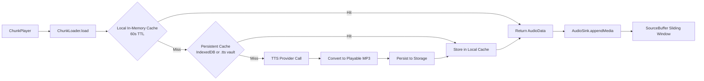
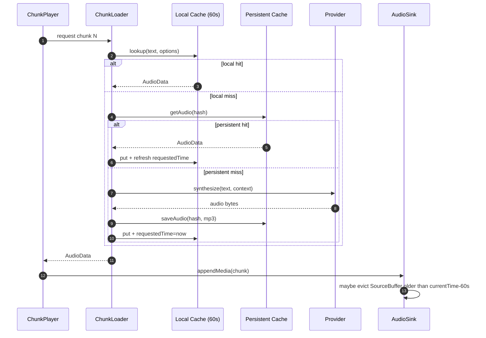

# Caching And Eviction

This document describes how audio caching and eviction currently work across memory, browser storage, and Obsidian vault storage.

## End-To-End Cache Flow



## Cache Layers

### Layer 1: In-Memory Request Cache (`ChunkLoader`)
- File: `src/player/ChunkLoader.ts`
- Scope: Current playback session only.
- Key: `(chunk text, model options)`.
- Value: `Promise<AudioData>` plus request timestamp.
- TTL: 60 seconds (`MAX_LOCAL_TTL_MILLIS`).
- Purpose: Avoid duplicate TTS requests while chunk loading/preloading is active.

### Layer 2: Persistent Audio Cache (`AudioCache`)
- Files: `src/obsidian/ObsidianPlayer.ts`, `src/web/IndexedDBAudioStorage.ts`, `src/player/AudioCache.ts`.
- Scope: Across playback sessions and plugin restarts.
- Key: Hash of `(text, model options, output format)` from `hashAudioInputs`.
- Backends:
  - `local`: IndexedDB (default).
  - `vault`: `.tts` folder in Obsidian vault.
- Purpose: Reuse previously generated MP3 chunks without calling provider APIs again.

### Layer 3: MediaSource/SourceBuffer Window (`AudioSink`)
- File: `src/player/AudioSink.ts`.
- Scope: Current active HTML audio element.
- Behavior: Appends chunk MP3 bytes as playback progresses.
- Eviction: Trims data older than 60 seconds behind `currentTime` (`MAX_BUFFER_BEHIND_SECS`).
- Purpose: Prevent unbounded native media memory growth for long playback sessions.

## Eviction Paths

### Time-Based Persistent Cache Expiry (`AudioStore`)
- File: `src/player/AudioStore.ts`.
- Trigger: Startup and periodic interval.
- Source of truth: `settings.cacheDurationMillis`.
- Effect: Calls `storage.expire(ageInMillis)` on active backend.

### In-Memory Cache Expiry (`ChunkLoader`)
- File: `src/player/ChunkLoader.ts`.
- Trigger: Internal garbage collector interval (`MAX_LOCAL_TTL_MILLIS / 2`).
- Effect: Removes stale entries from local in-memory cache.

### Position-Based Queue/Chunk Pruning (`ChunkPlayer`)
- File: `src/player/ChunkPlayer.ts`.
- Trigger: Load loop and SourceBuffer state checks.
- Effects:
  - Drops background preload requests behind the current playback position.
  - Resets chunk state for chunks fully before `audio.buffered.start(0)`.
  - Clears matching in-memory cached entries via `chunkLoader.uncache(text)`.
  - Releases decoded `AudioBuffer` objects for older chunks to reduce native memory pressure.

### SourceBuffer Data Trimming (`AudioSink`)
- File: `src/player/AudioSink.ts`.
- Trigger: After each successful `appendMedia`.
- Effect: Calls `SourceBuffer.remove(start, currentTime - 60s)` when behind-window threshold is exceeded.
- Note: This is best-effort and intentionally does not fail playback if removal errors occur.

## Timing Diagrams

### Playback + Cache Timing



### Eviction Cadence (Wall-Clock + Playback Time)

```text
Wall clock time -------------------------------------------------------------->

ChunkLoader local cache GC:   |---- every 30s ----|---- every 30s ----| ...
                              removes entries older than 60s requestedTime

AudioStore persistent expire: |-- startup --|--- periodic interval ---> ...
                              interval derived from cacheDurationMillis

Playback time (audio.currentTime) ------------------------------------------->

SourceBuffer retained window:  [........... <= 60s behind playhead ..........][PLAYHEAD][ahead]
                               any data older than this window is removed on append
```

## Lifecycle Cleanup

- `TTSPlugin.onunload()` now explicitly disposes synchronization, player, audio sink, bridge, and cache reaction.
- `WebAudioSink.destroy()` removes listeners, clears media source state, detaches `src`, forces reload, and revokes the object URL.
- `ObsidianBridge.destroy()` unsubscribes workspace events and unmounts the tab icon React root.

## Operational Notes

- Cache hits are format-specific. Playback cache currently targets MP3 for direct MediaSource playback.
- Text identity plus model options determines cache reuse, so changing provider/model/voice naturally invalidates prior entries.
- Incremental text-edit patching is not implemented yet; current behavior still performs full audio reset on detected text changes.
