# Audio Player Architecture

This document explains how the audio playback system works through the collaboration of three main components: `ChunkPlayer`, `ChunkLoader`, and `AudioSink`.

## Overview

The audio player architecture is designed to provide seamless text-to-speech playback with intelligent buffering, caching, and state management. The system breaks text into chunks and loads them incrementally while maintaining smooth playback.

## Component Overview

### ChunkPlayer
The orchestrator that manages the entire playback lifecycle, coordinates between components, and handles state transitions.

### ChunkLoader
The loading and caching engine that manages audio chunk requests, background loading, and persistent storage.

### AudioSink
The low-level audio playback engine that handles streaming audio data using the Web Audio API.

## Architecture Diagram


## Component Details

### ChunkPlayer (The Orchestrator)

The `ChunkPlayer` is the central coordinator that manages the entire audio playback lifecycle.

#### Key Responsibilities:
- **State Management**: Monitors playing state, position changes, and text modifications
- **Buffer Management**: Ensures chunks are loaded ahead of playback position
- **Coordination**: Orchestrates between ChunkLoader and AudioSink
- **Event Handling**: Responds to seek events, play/pause, and settings changes
- **Error Recovery**: Handles interruptions and state resets

#### Main Loop Flow:


#### Buffer Management:
- Maintains a configurable buffer ahead of current position (default: 3 chunks)
- Preloads chunks with context for smooth TTS transitions
- Expires old chunks behind current position to manage memory

### ChunkLoader (The Loading Engine)

The `ChunkLoader` manages audio chunk loading with sophisticated caching and background processing.

#### Key Features:
- **Local Memory Cache**: Fast access to recently loaded chunks
- **Background Queue**: Preloads chunks without blocking playback
- **Persistent Storage**: Long-term caching via storage layer
- **Retry Logic**: Automatic retry with exponential backoff
- **Context Awareness**: Includes surrounding text for better TTS quality

#### Loading Flow:


#### Caching Strategy:
- **Memory Cache**: Short-term (60s TTL) for immediate reuse
- **Persistent Storage**: Long-term storage across sessions
- **Background Loading**: Proactive loading during idle time
- **Queue Management**: Prioritizes chunks near current position

### AudioSink (The Playback Engine)

The `AudioSink` handles low-level audio streaming using the Web Audio API with MediaSource.

#### Key Features:
- **Streaming Playback**: Uses SourceBuffer for seamless audio streaming
- **Dynamic Loading**: Appends audio chunks as they become available
- **State Tracking**: Monitors playback state and completion
- **Seek Support**: Handles time-based navigation
- **Rate Control**: Variable playback speed support

#### Audio Streaming Process:

```mermaid
graph LR
    subgraph "AudioSink"
        MS[MediaSource]
        SB[SourceBuffer]
        AUDIO[HTML Audio Element]
        
        MS --> SB
        SB --> AUDIO
    end
    
    subgraph "Data Flow"
        AB1[ArrayBuffer 1] --> SB
        AB2[ArrayBuffer 2] --> SB
        AB3[ArrayBuffer 3] --> SB
    end
    
    AUDIO --> SPEAKER[🔊 Speaker]
```



#### State Management:
- **Playing**: Audio is actively playing
- **Paused**: Audio is stopped but ready to resume
- **Complete**: Current chunk/track has finished

## Component Collaboration

### Initialization Flow


### Playback Flow


### Error Handling Flow


## Key Design Patterns

### 1. Producer-Consumer Pattern
- **ChunkLoader** produces audio data
- **AudioSink** consumes audio data
- **ChunkPlayer** coordinates the flow

### 2. Observer Pattern
- Components observe MobX state changes
- Reactive updates to position, settings, and text changes

### 3. State Machine Pattern
- **AudioSink** tracks playback states
- **ChunkPlayer** manages loading states
- Clear state transitions and event handling

### 4. Background Processing
- **ChunkLoader** uses background queues
- **IntervalDaemon** for periodic processing
- Non-blocking preloading

## Performance Optimizations

### Memory Management
- **Garbage Collection**: Automatic cleanup of old cached audio
- **Position-based Expiry**: Remove chunks behind current position
- **TTL-based Cleanup**: Time-based cache expiration

### Network Efficiency
- **Background Preloading**: Load chunks before needed
- **Context-aware TTS**: Include surrounding text for better quality
- **Retry Logic**: Handle temporary failures gracefully

### Audio Quality
- **Seamless Transitions**: Context-aware chunk generation
- **Buffer Management**: Maintain smooth playback
- **Variable Speed**: Dynamic playback rate adjustment

## Configuration

Key configuration parameters that affect the collaboration:

```typescript
const BUFFER_AHEAD = 3;              // Chunks to buffer ahead
const CHUNK_CONTEXT_SIZE = 3;        // Context chunks for TTS
const MAX_BACKGROUND_REQUESTS = 3;   // Concurrent background loads
const MAX_LOCAL_TTL_MILLIS = 60000;  // Cache TTL in milliseconds
```

## Debugging and Monitoring

### Key Observable States
- `activeAudioText.position`: Current playback position
- `audioSink.trackStatus`: Playback state
- `audioSink.currentTime`: Precise playback position
- `chunkLoader.backgroundQueue`: Pending loads

### Common Issues
1. **Buffer Underrun**: Chunks not loading fast enough
2. **Memory Leaks**: Cache not being cleaned up
3. **State Desync**: Position mismatch between components
4. **API Failures**: TTS service errors

This architecture provides a robust, scalable solution for text-to-speech playback with intelligent buffering and seamless user experience. 